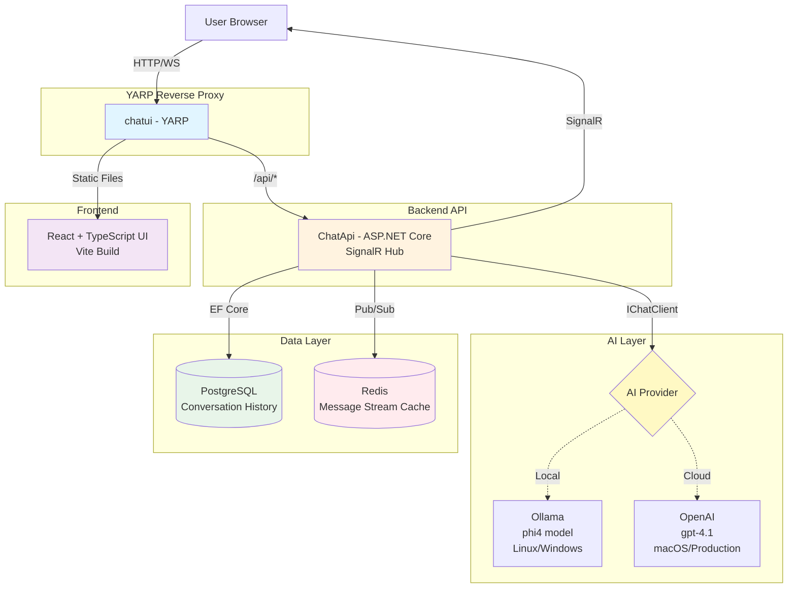

# Aspire AI Chat

Aspire AI Chat is a full-stack chat sample that combines modern technologies to deliver a ChatGPT-like experience.

## Architecture



## High-Level Overview

- **Backend API:**  
  The backend is built with **ASP.NET Core** and interacts with an LLM using **Microsoft.Extensions.AI**. It leverages `IChatClient` to abstract the interaction between the API and the model. Chat responses are streamed back to the client using **SignalR** for real-time communication.

- **Data & Persistence:**  
  Uses **Entity Framework Core** with **PostgreSQL** for reliable relational data storage. **Redis** is used for caching and broadcasting live message streams across multiple clients.

- **AI & Chat Capabilities:**  
  - Uses **Ollama** (via OllamaSharp) for local inference on Linux/Windows.  
  - On macOS, the application uses [**OpenAI**](https://openai.com/) directly for better compatibility.
  - In production, the application can be configured to use various AI providers through the abstraction layer.

- **Frontend UI:**  
  Built with **React** and **TypeScript** using **Vite** for fast development and builds. The UI provides a modern chat interface with support for markdown rendering and conversation history.

- **Reverse Proxy & Serving:**  
  Uses **YARP** (Yet Another Reverse Proxy) to serve the static frontend and proxy API requests, providing a unified endpoint.

## Getting Started

### Prerequisites

- [.NET 10.0 SDK](https://dotnet.microsoft.com/en-us/download/dotnet/10.0)
- [Docker](https://www.docker.com/get-started) or [Podman](https://podman-desktop.io/)
- [Node.js](https://nodejs.org/) (LTS version recommended)

### Running the Application

Run the [AIChat.AppHost](AIChat.AppHost) project using the .NET Aspire tooling:

```bash
aspire run
```

This project uses [.NET Aspire](https://learn.microsoft.com/en-us/dotnet/aspire/get-started/aspire-overview) to orchestrate the application components in containers.

### Configuration

- By default, the application uses **Ollama** (phi4 model) for local inference on Linux/Windows.  
- On **macOS**, it automatically switches to **OpenAI** and will prompt for your OpenAI API key if not already configured.
- The **PostgreSQL** database and **Redis** cache are automatically provisioned when running with Aspire.
- Access the Aspire dashboard to monitor resources and view logs.

## CI/CD

The project includes a GitHub Actions workflow that:

- Builds container images for both the API and UI
- Tags images with format: `<branch>-<build-number>-<git-sha>`
- Pushes images to GitHub Container Registry (GHCR)

Images are available at: `ghcr.io/<owner>/chatapi` and `ghcr.io/<owner>/chatui`
